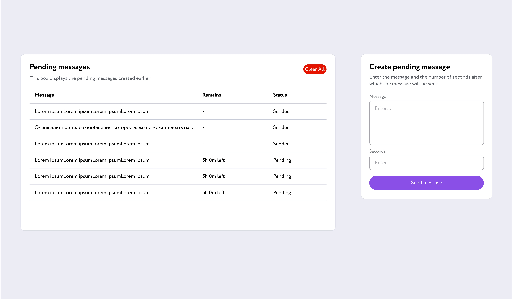
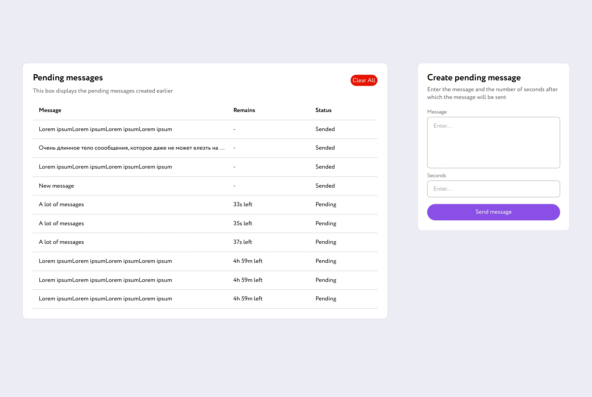
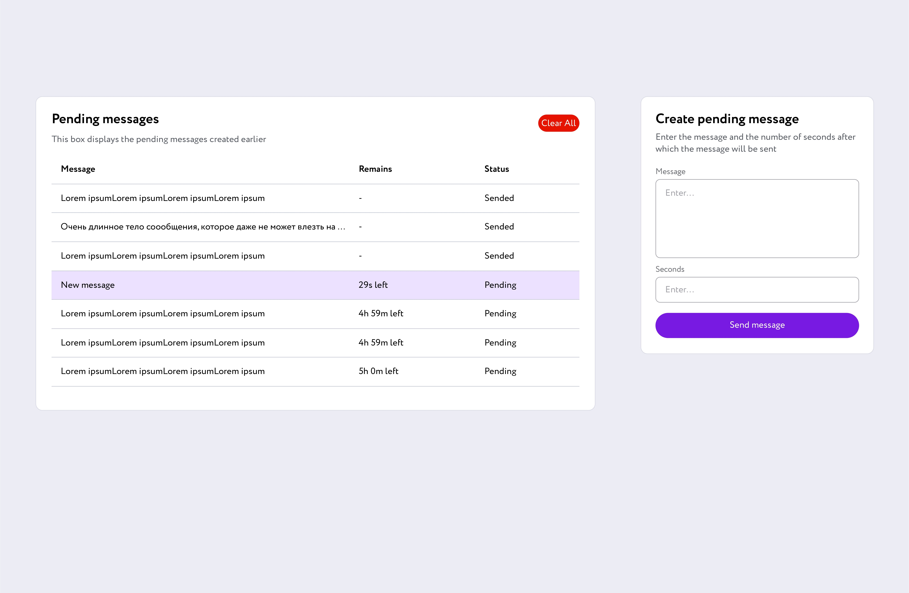
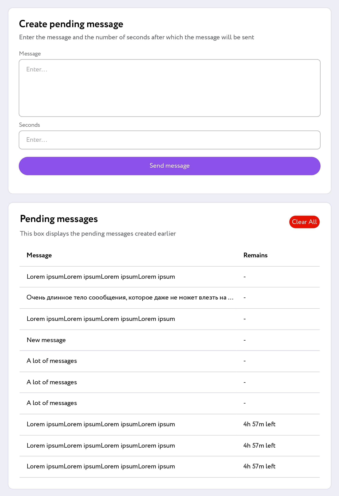
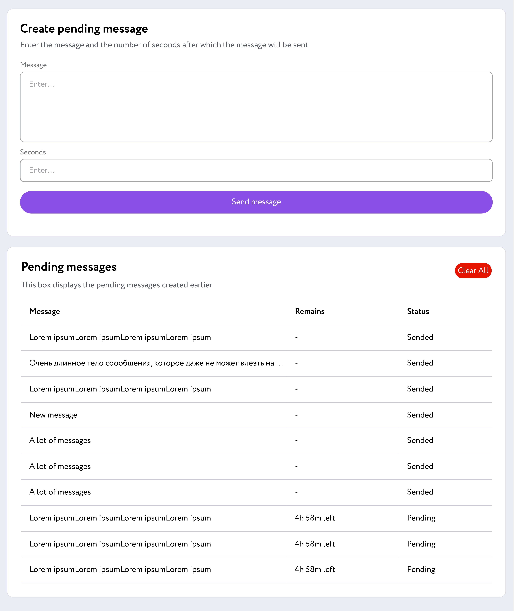

# test_ff_pending_msgs

В рамках тестового задания реализован функционал по созданию отложенных сообщений

Форма принимает **тело сообщения** и **количество секунд**, через которое сообщение должно будет отправиться. Пример такой формы изображен на рисунке ниже

В таблице отображаются созданные ранее отложенные сообщения, статус отправки сообщения и время, которое осталось до его отправки с момента создания (`Sended`/`Pending`)

### Дополнения не по ТЗ

- Все строки в таблице имеют одинаковую высоту (в тз строки 2-6 выше на 8 пикселей, но это смотрится не очень гармонично)
- Обрезка текста в таблице троеточием происходит не так далеко от столбца Remains
- Подсветка новых строк на 1.5 секунды
- Изменение цвета кнопки и курсора при наведении на кнопку, ее активации или фокусировании на ней
- Ограничения на время ожидания — от 1 секунды до 366 дней
- Доступны несколько вариантов отображения оставшегося времени, в зависимости от того, сколько времени осталось, от `5d 1h left` до `5m 1s left`
- Данные из таблицы всегда отсортированы по времени отправки (раньше отправляется — выше )
- Данные из таблицы хранятся в локальной памяти и не сбрасываются после обновления страницы
- Если таблица занимает много места и уже не помещается в соответствующий блок, он расширяется по высоте
- Можно очистить таблицу, в том числе в локальной памяти, нажав на красную кнопку (она добавлена в относительно свободное место сверху таблицей)
- Адаптивность: на мобильных и небольших экранах блоки перестраиваются вертикально, причем форма находится выше таблицы, оба блока занимают одинаковую ширину
- В момент окончания «таймера» статус сменяется с `Pending` на `Sended`

Все эти изменения можно изменить или отменить

<table>
  <tr>
    <td> Большое количество сообщений </td>
    <td> Подсветка нового сообщения </td>
  </tr>
  <tr>
    <td> Вид на мобильных экранах </td>
    <td> Вид на небольших экранах </td>
  </tr>
</table>

[Посмотреть в действии](https://maxina29.github.io/test_ff_pending_msgs/index.html)